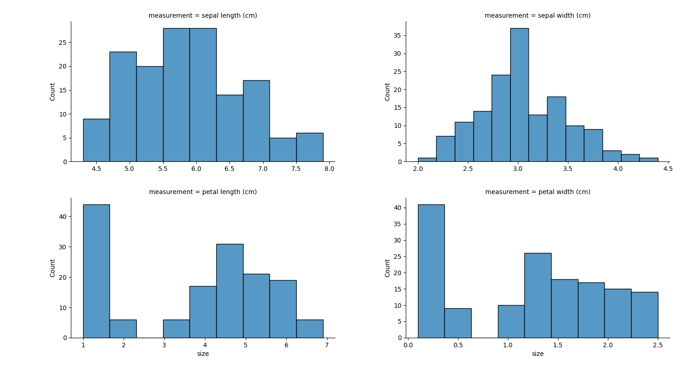
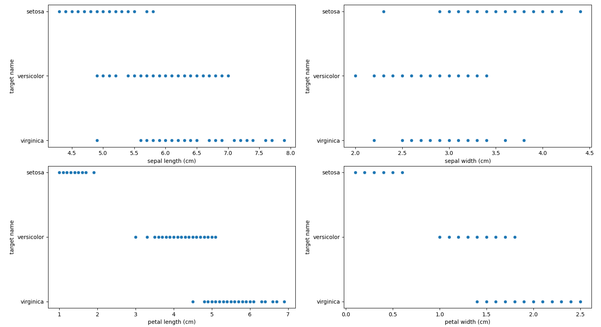
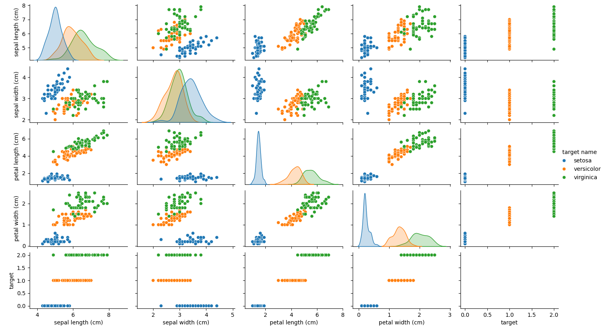
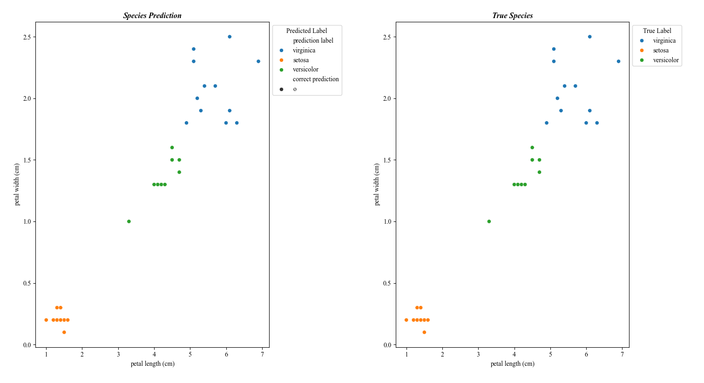

### Iris Classification Project:

Goal:

- To classify type of Iris flower, given four flower feature measurements, using logistic regression.

Iris data cols:

- sepal length (cm)
- sepal width (cm)
- petal length (cm)
- petal width (cm)
- target

Notes:

- Data split into training data (large %) and testing data (small %).
- Train model using training data, and test model on unseen testing data. Predictions always use data unseen by model
  thus far.
- Model trained by splitting training data into x and y data, x will be amended to have just characteristics (flower
  measurements) and y amended to just be the ground truth (correct flower species).
- Cross validation includes validation of the model where we use data split into train/test in different ways (i.e.
  model 1 using first fifth of data for testing, model 2 using second fifth of data for testing etc...)
- This is a supervised learning case, as we know what the correct answers are.
- Model tuning is trying to determine your model parameters (hyperparameters) that maximise model accuracy.
- Regularization is a key parameter, it is how much flexibility we give to our model, to fit all given data.
- We want to avoid overfitting, which is where the model learns the underlying patterns (and noise) in our training
  data. Patterns and noise will likely not exist in real life data.
- Logistic regression is a classification algorithm, used to predict the probability of a specific outcome. In
  scikit-learn we train the logistic regression model with model.fit(x_train, y_train).

Key Numbers:

- single_feature_model accuracy: 95.54%
- logistic_regression_model accuracy: 100.00%
- final_logistic_regression_model accuracy: 97.37%
- logistic_regression_model cross validation score: 97.39%
- random_forest_model cross validation score: 95.61%

Source:

- [Intro to Machine Learning with Python Course - The Iris Dataset](https://www.youtube.com/playlist?list=PLMAyPTgGwv2DUV6DZib9eMetsTTX87JNr)

Plots:

Iris measurement histograms:

Measurement vs Species scatter graphs:

Species pairplot graphs:

Regularization vs Model accuracy scatter graph:

Species prediction scatter Graph:
