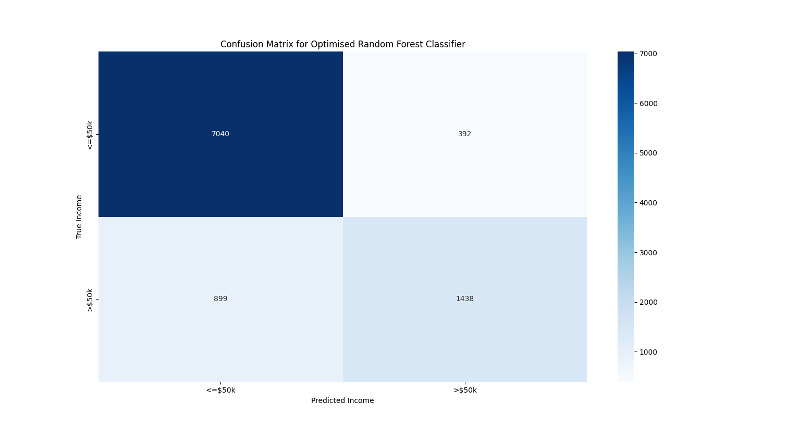

### Learning SciKitLearn

[scikit-learn.org](https://scikit-learn.org/)

---

**_Iris Species Prediction:_**

- Using a model trained on Iris flower measurements (petal length, petal width, sepal legth, speal width) we predict the
  species.

Species prediction scatter Graph:

more plots in species_prediction directory.

---

**_House Value Prediction:_**

- Using a model trained on California housing data (bedrooms, bathrooms, lat, lng...), we predict the house value.

Values capped at $500k in raw data, leading to anomalous predictions:

more plots in price_prediction directory.

---

**_Personal Income Prediction:_**

- Using a model trained on various personal attributes (age, gender, education...), we predict a person's income.

Confusion matrix showing predicted incomes vs true incomes:

more plots in income_prediction directory.