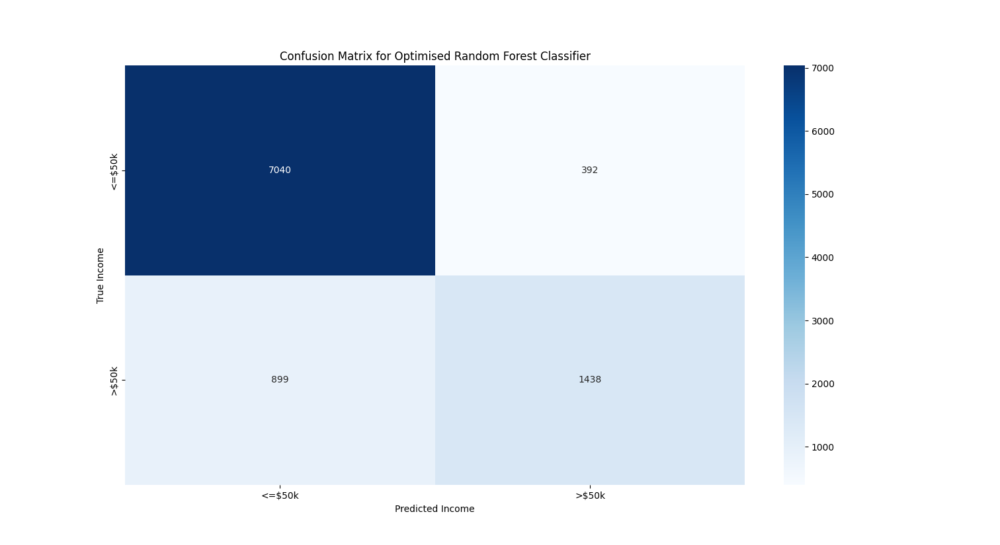

### Personal Income Prediction Project:

Goal:

- Using machine learning to predict a person's income, based on various personal attributes.

Personal data cols:

- age
- workclass
- fnlwgt
- education
- educational-num
- marital-status
- occupation
- relationship
- race
- gender
- capital-gain
- capital-loss
- hours-per-week
- native-country
- income

Notes:

- One hot encoding is very useful for converting one text category column into n binary columns.
- We can use pandas corr() to investigate correlations between all columns/attributes. Or simply one chosen column vs
  the rest (allowing us to drop columns with low correlation to target attribute).
- Grid search allows us to iterate through all combinations of chosen model parameters, and find the best combination.
  Doing so here bumped our model accuracy from 84.81% to 86.24%.

Model Accuracies:

- Defualt random forest classifier: 84.81%
- Optimised random forest classifier: 86.24%

Source:

- Course: [Income Prediction Machine Learning Project in Python](https://www.youtube.com/watch?v=dhoKFqhVJu0)

- Data: [Adult income dataset](https://www.kaggle.com/datasets/wenruliu/adult-income-dataset)

Plots:

Heatmap showing correlation between income attributes:

Confusion matrix showing predicted incomes vs true incomes:
