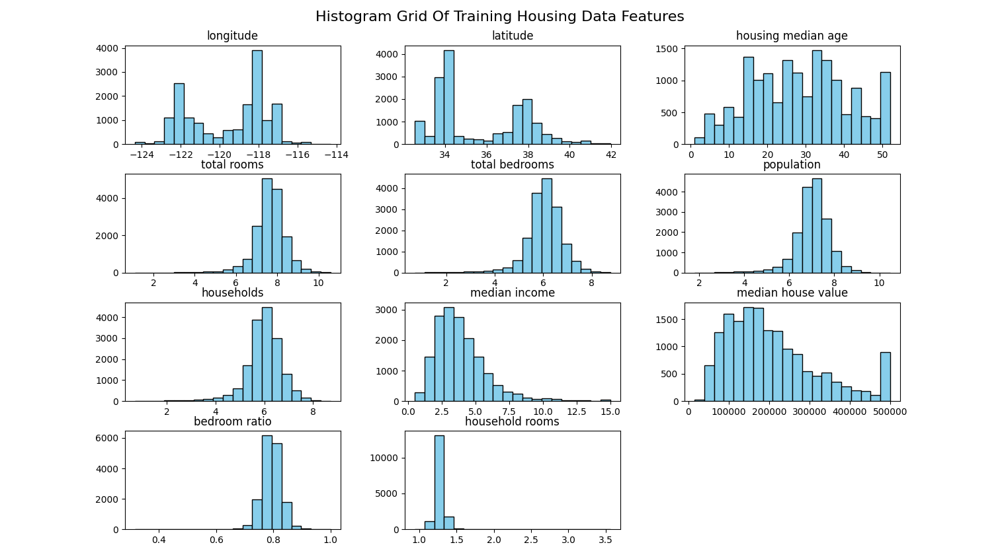
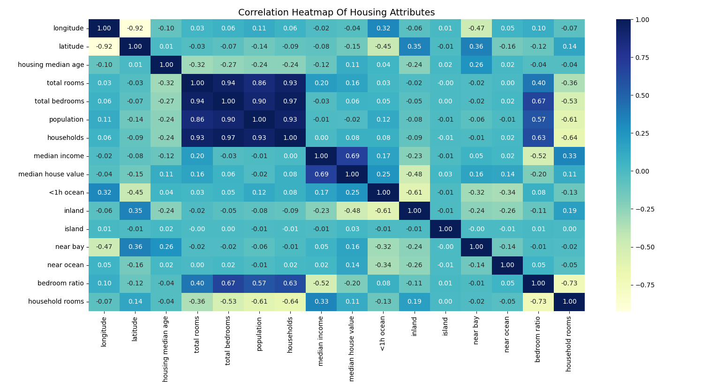
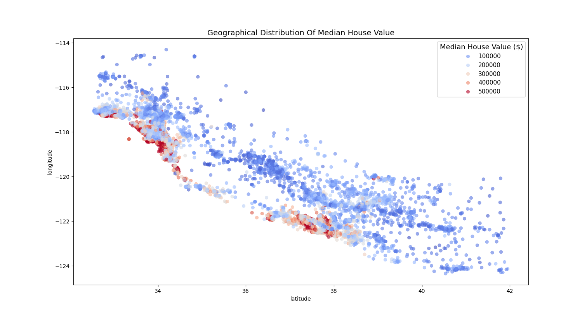
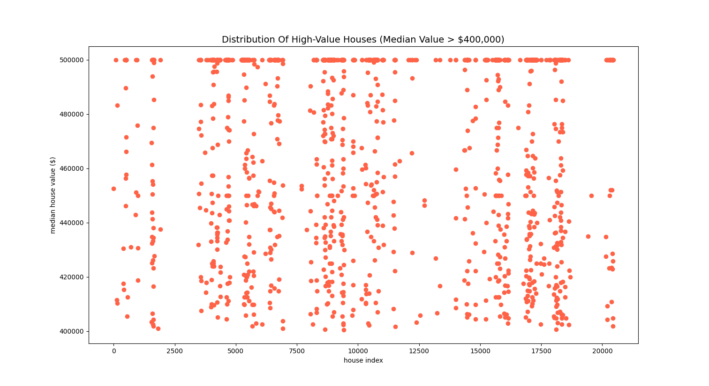
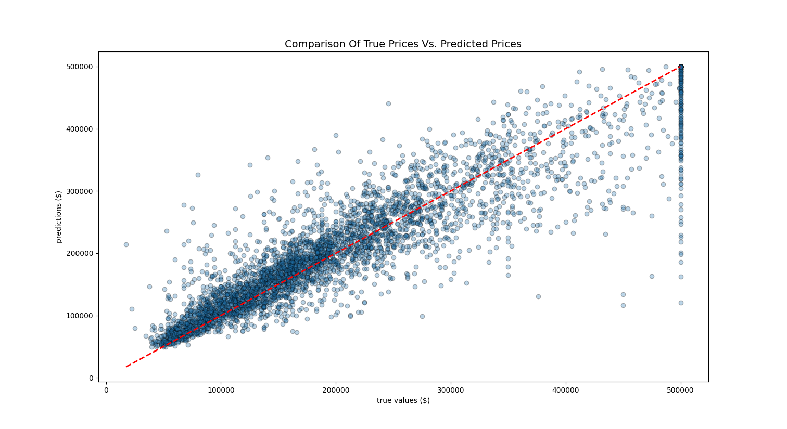

### House Price Prediction Project:

Goal:

- Using a model trained on California housing data, we want to predict the house price, given all other house
  attributes (detailed below).

Housing data cols:

- longitude
- latitude
- housing_median_age
- total_rooms
- total_bedrooms
- population
- households
- median_income
- median_house_value
- ocean_proximity

Notes:

- Linear regression models the relationship between a dependent variable and 1+ independent variables by fitting a
  linear equation to given data.
- Random forest regression is an ensemble learning method. Lots of decision trees are trained, and the
  outcome/prediction of each will be added up, model outcome is average of all predictions.
- Skewed data columns can be transformed with log function, for normality, scale reduction, reduced outlier impact and
  better represent proportional changes.

Model Accuracies:

- linear_regression_model: 65.62%
- scaled_linear_regression_model: 65.62%
- random_forest_model: 80.34%
- scaled_random_forest_model: 80.24%
- clean_random_forest_model: 80.38%

Source:

- Course: [House Price Prediction in Python](https://www.youtube.com/watch?v=Wqmtf9SA_kk)

- Data: [California Housing Prices](https://www.kaggle.com/datasets/camnugent/california-housing-prices/)

Values capped at $500k in raw data:

Leading to anomalous predictions:
